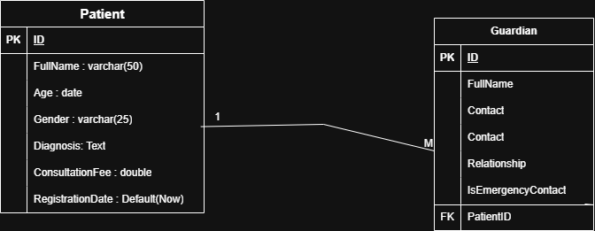

# Patient-Management-Information-System
A Java-based desktop application for managing patient records using MVC architecture and JDBC (DAO pattern).

### Features
Add, view, search, update, and delete patients
Automatic validation and business rules
Discount system based on age
Patient summary using JTable
Guardian management (for minors or dependents)
### Database

Database name: PMIS_db

**Patient**
* patientID (PAT-####)
* fullName, age, gender
* diagnosis, consultationFee
* registrationDate (auto)

**Guardian**
* guardianID
* fullName, phoneNumber, relationship
* patientID (FK)

### Business Rules
* Age < 12 → 50% discount
* Age > 60 → 30% discount
* Fee range: 5,000 – 50,000 RWF

### ERD(Entity Relationship Diagram)

### System Architecture (MVC)

### Tech Stack
1. Java (Swing, JFrame)
2. JDBC
3. MySQL / PostgreSQL
4. MVC + DAO Pattern
### To Get Started , Run
`git clone https://github.com/oger1999/Patient-Management-Information-System.git`

Configure DB in DBConnection.java, then run the project.

